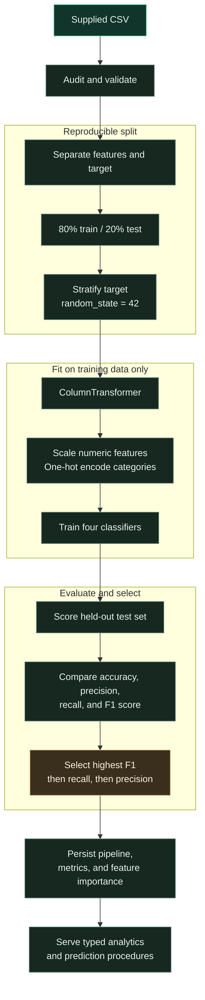

# ChurnIQ

### Retention intelligence for teams that act before customers leave.

ChurnIQ is a dataset-backed customer churn analytics SaaS built to turn customer behavior into clear retention decisions. It combines an executive dashboard, segment analytics, transparent model evaluation, and a guided customer-level prediction workflow in one focused workspace.

> **The core principle:** every KPI, model metric, risk bucket, feature-importance value, confusion-matrix count, and prediction probability is generated from the supplied customer dataset and the persisted trained model. ChurnIQ does not use synthetic customer records or hardcoded ML results.

[](https://react.dev/)
[](https://www.typescriptlang.org/)
[](https://www.python.org/)
[](https://scikit-learn.org/)
[](#quality-gates)

---

## Product snapshot

| Workspace | What it answers |
| --- | --- |
| **Overview** | How many customers are at risk, what is driving churn, and where should an executive focus? |
| **Segments** | Which subscription, contract, behavioral, age, and gender segments show the highest observed churn rates? |
| **Model lab** | Which classifier performs best on held-out data, and how reliable are its decisions? |
| **Predict a customer** | What is the fitted model’s churn probability for one dataset-aligned customer profile? |
| **Dataset explorer** | Can an analyst trace dashboard evidence back to the original source records? |

The interface uses a dark evergreen visual system with mint signal accents, restrained depth, responsive navigation, and an analyst-style information hierarchy rather than a generic admin-template layout.

## Verified dataset

ChurnIQ uses the supplied `customer_churn_dataset-testing-master.csv` as its source of truth. The audit is performed programmatically before model training.

| Measure | Verified value |
| --- | ---: |
| Customer records | **64,374** |
| Columns | **12** |
| Churned customers | **30,493** |
| Retained customers | **33,881** |
| Overall churn rate | **47.4%** |
| Missing values | **0** |
| Duplicate rows | **0** |
| Negative numeric observations | **0** |

The target is `Churn`, where `1` means churned and `0` means retained. `CustomerID` is retained for source-record inspection only and is excluded from preprocessing, training, inference, feature importance, and explanations.

### Training features

The model receives the following customer attributes:

| Numeric | Categorical |
| --- | --- |
| `Age` | `Gender` |
| `Tenure` | `Subscription Type` |
| `Usage Frequency` | `Contract Length` |
| `Support Calls` |  |
| `Payment Delay` |  |
| `Total Spend` |  |
| `Last Interaction` |  |

No rows are removed because the supplied source contains no missing values, duplicate records, or negative numeric observations. These are data-quality assumptions for this release and should be rechecked whenever the source dataset changes.

## Real ML workflow

The training engine follows a reproducible held-out evaluation workflow:



### Candidate models

ChurnIQ trains all four required classifiers:

1. **Logistic Regression**
2. **Random Forest**
3. **Support Vector Machine** using a calibrated `LinearSVC` for practical probability output
4. **K-Nearest Neighbors**

Preprocessing is part of the fitted pipeline. Numerical features use `StandardScaler` for scale-sensitive models, while categorical features use `OneHotEncoder(handle_unknown="ignore")`. The test set never fits preprocessing.

### Reproducible held-out results

The current build uses 51,499 training rows and 12,875 testing rows.

| Model | Accuracy | Precision | Recall | F1 score |
| --- | ---: | ---: | ---: | ---: |
| Logistic Regression | 82.70% | 81.36% | 82.36% | 81.85% |
| Random Forest | **99.84%** | **99.93%** | **99.74%** | **99.84%** |
| Support Vector Machine | 82.70% | 81.31% | 82.44% | 81.87% |
| K-Nearest Neighbors | 91.65% | 88.36% | 94.87% | 91.50% |

**Selected model: Random Forest.** Model selection is calculated programmatically from the held-out metrics using F1 score as the primary criterion, followed by recall and precision. Recall is surfaced prominently because false negatives represent customers who churned but were predicted to stay.

### Selected-model confusion matrix

| Outcome | Meaning | Count |
| --- | --- | ---: |
| True negative | Stayed and predicted stay | **6,772** |
| False positive | Stayed but predicted churn | **4** |
| False negative | Churned but predicted stay | **16** |
| True positive | Churned and predicted churn | **6,083** |

Random Forest feature importance is extracted from the fitted pipeline with one-hot encoded names preserved, so categorical contributions remain traceable to values such as `Subscription Type_Basic` or `Contract Length_Monthly`.

## Prediction experience

The prediction workspace accepts the same schema used for training. It returns:

- The selected model’s probability from `predict_proba`.
- A `Low`, `Medium`, or `High` risk band using documented probability thresholds.
- A recommended retention priority: **Monitor and nurture**, **Proactive check-in**, or **Immediate outreach**.
- Model-based local counterfactual drivers. Each driver measures how the fitted model probability changes when one input is replaced with the source-data median or mode.

These explanations are decision-support cues, not causal claims or guarantees of customer behavior.

## Architecture

```text
React 19 + Vite + TypeScript + Tailwind 4 + Recharts
                          │
                          │ typed tRPC procedures
                          ▼
Express 4 + tRPC 11 server
                          │
                          │ child-process bridge
                          ▼
Python ML engine
  ├── pandas / NumPy dataset audit
  ├── scikit-learn preprocessing and models
  ├── joblib persisted pipelines
  └── JSON analytics and metadata artifacts
```

### Project structure

```text
.
├── client/
│   ├── src/pages/Home.tsx          # ChurnIQ dashboard experience
│   ├── src/index.css               # Product visual system
│   └── src/App.tsx                 # Application shell
├── server/
│   ├── ml.ts                       # Typed Node-to-Python ML bridge
│   ├── routers.ts                   # Typed tRPC procedures
│   ├── churn.test.ts                # Analytics and prediction tests
│   └── ml/
│       ├── train_and_predict.py    # Audit, training, analytics, prediction engine
│       ├── data/                    # Supplied source CSV
│       └── artifacts/               # Persisted model and analytics outputs
├── Dockerfile                       # Node + Python production runtime
├── drizzle/                         # Auth/database scaffold
├── todo.md                          # Implementation assumptions and QA history
└── package.json
```

## Getting started

### Prerequisites

For local development, install **Node.js 22+**, **pnpm 10+**, and **Python 3.11+**. The Python environment needs pandas, NumPy, scikit-learn, and joblib.

```bash
python3 -m pip install pandas numpy scikit-learn joblib
```

### Install and run

```bash
git clone <your-repository-url>
cd churn-prediction-v2
pnpm install
pnpm dev
```

The development server will expose the application through the configured local preview port.

### Rebuild ML artifacts

The repository includes the current persisted artifacts. To retrain all four models from the supplied CSV and regenerate analytics:

```bash
python3 server/ml/train_and_predict.py train
```

Useful inspection commands:

```bash
python3 server/ml/train_and_predict.py audit
python3 server/ml/train_and_predict.py analytics
```

The model engine writes these files under `server/ml/artifacts/`:

| Artifact | Purpose |
| --- | --- |
| `best_model.joblib` | Complete selected preprocessing + classifier pipeline |
| `all_models.joblib` | Fitted candidate model pipelines |
| `model_metadata.json` | Split policy, metrics, selected model, audit, and training metadata |
| `feature_importance.json` | Ranked Random Forest importance with encoded feature names |
| `analytics.json` | Dashboard KPIs, risk distribution, segment rates, correlations, and demographics |

## Typed backend procedures

The frontend uses the generated tRPC client rather than ad hoc HTTP wrappers.

| Procedure | Type | Purpose |
| --- | --- | --- |
| `churn.analytics` | Query | Dashboard KPIs, risk distribution, segments, correlations, demographics, model metrics, and feature importance |
| `churn.audit` | Query | Dataset schema, quality checks, target distribution, ranges, and assumptions |
| `churn.explorer` | Query | Searchable, paginated source-record inspection |
| `churn.predict` | Mutation | Validated customer profile scoring with probability, risk, priority, and local explanation |

All prediction input fields are validated with Zod against the dataset’s categories and numeric ranges.

## Quality gates

The current project passes:

```bash
pnpm check
pnpm test
pnpm build
```

The test suite covers the existing authentication regression plus two churn-specific checks: measured analytics/model metadata and a valid single-customer probability response. Desktop and 375px mobile previews were also reviewed during verification.

## Deployment notes

The root `Dockerfile` is intentional because production inference requires Python and scikit-learn in the runtime image. It installs the Node and Python runtimes, runs the complete Vite and server build, and starts the bundled Express server with:

```dockerfile
CMD ["node", "dist/index.js"]
```

The application is designed for the managed project hosting environment. Publishing is intentionally left to the project owner through the hosting interface.

## Responsible use

ChurnIQ is an analytical decision-support tool. Segment differences and feature importance indicate associations in the supplied dataset; they do not establish causality. Retention teams should combine model output with customer context, policy, consent, and human review before taking action. The dataset should be refreshed and the model reevaluated when customer behavior, product packaging, or business definitions change.

## License

No license has been selected yet. Add a repository license before distributing or accepting external contributions.

## References

[1]: https://scikit-learn.org/stable/modules/compose.html "scikit-learn ColumnTransformer and Pipeline documentation"
[2]: https://scikit-learn.org/stable/modules/generated/sklearn.model_selection.train_test_split.html "scikit-learn train_test_split documentation"
[3]: https://scikit-learn.org/stable/modules/generated/sklearn.metrics.html "scikit-learn classification metrics documentation"
